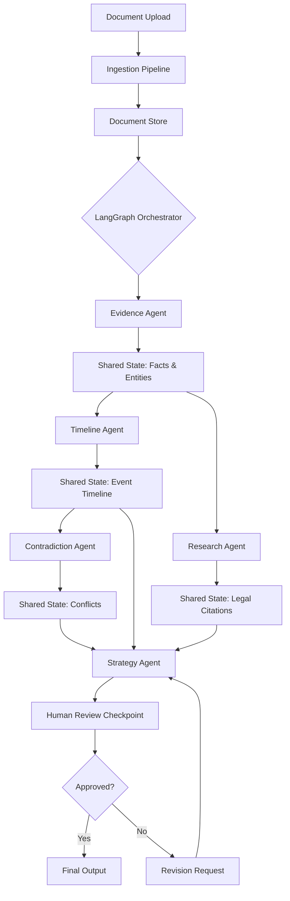
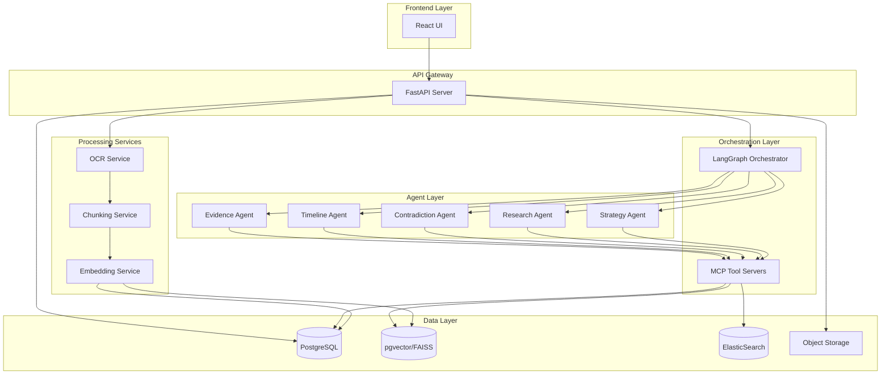

# Agentic Legal Team - Architecture & Implementation Plan

## Document Purpose

This document provides a comprehensive breakdown of:
1. The multi-agent workflow architecture and how agents collaborate
2. The complete project structure and component relationships
3. A phased implementation roadmap with clear milestones
4. Technical decisions and design patterns for each component

This serves as the master reference for building the Agentic Legal Team system incrementally.

---

## Part 1: Agentic Workflow Architecture

### 1.1 Core Workflow Concept

The system uses a **graph-based multi-agent orchestration** pattern where specialized agents collaborate through shared state and conditional routing. Unlike a single monolithic AI, this architecture:

- **Decomposes complexity** into focused agent responsibilities
- **Reduces context overload** by limiting each agent's scope
- **Enables tool specialization** through agent-specific capabilities
- **Preserves traceability** by tracking data flow between agents
- **Supports human oversight** at critical decision points

### 1.2 Agent Collaboration Model



### 1.3 Agent Roles and Responsibilities

#### Evidence Agent
**Purpose:** Extract structured facts from unstructured documents

**Inputs:**
- Raw document text (OCR-processed or native)
- Document metadata (source, date, type)

**Processing:**
- Named entity recognition (people, places, organizations, dates)
- Fact extraction and claim identification
- Document summarization
- Evidence item cataloging

**Outputs:**
- Structured entity records
- Extracted claims with source references
- Document summaries
- Evidence metadata

**Tools Used:**
- Document retrieval tool
- Entity extraction tool
- Structured output formatter

#### Timeline Agent
**Purpose:** Construct chronological event sequences

**Inputs:**
- Extracted facts from Evidence Agent
- Date/time references from documents
- Event descriptions

**Processing:**
- Temporal ordering of events
- Date normalization and resolution
- Gap identification
- Conflict detection in timing

**Outputs:**
- Chronologically ordered event list
- Timeline visualization data
- Temporal conflict flags
- Missing time interval reports

**Tools Used:**
- Timeline construction tool
- Date parser/normalizer
- Event linking tool

#### Contradiction Agent
**Purpose:** Identify inconsistencies across sources

**Inputs:**
- Extracted claims from Evidence Agent
- Timeline events
- Multiple witness/source statements

**Processing:**
- Cross-document claim comparison
- Factual inconsistency detection
- Confidence scoring
- Source attribution

**Outputs:**
- Contradiction reports with source citations
- Confidence scores for conflicts
- Reconciliation suggestions
- Disputed fact summaries

**Tools Used:**
- Claim comparison tool
- Similarity/difference analyzer
- Citation tracker

#### Research Agent
**Purpose:** Retrieve relevant legal authorities

**Inputs:**
- Extracted facts and legal issues
- Search queries from Strategy Agent
- Jurisdiction information

**Processing:**
- Semantic search over legal corpus
- Keyword/phrase matching
- Citation extraction
- Relevance ranking

**Outputs:**
- Relevant case law with citations
- Applicable statutes/regulations
- Legal precedent summaries
- Authority metadata

**Tools Used:**
- Vector search tool (semantic)
- ElasticSearch tool (keyword)
- Citation formatter
- Legal database connector

#### Strategy Agent
**Purpose:** Synthesize analysis into actionable insights

**Inputs:**
- All outputs from previous agents
- Case context and objectives
- Legal research results

**Processing:**
- Evidence synthesis
- Issue identification
- Strength/weakness analysis
- Recommendation generation

**Outputs:**
- Structured strategy memo
- Key issues summary
- Evidence gaps report
- Next steps recommendations

**Tools Used:**
- Synthesis tool
- Structured memo generator
- Citation aggregator

### 1.4 Shared State Management

The LangGraph orchestrator maintains a **shared state object** that flows between agents:

```python
# Conceptual shared state structure
{
    "case_id": "uuid",
    "documents": [...],
    "entities": {
        "people": [...],
        "places": [...],
        "organizations": [...],
        "dates": [...]
    },
    "facts": [...],
    "timeline": [...],
    "contradictions": [...],
    "research_results": [...],
    "strategy_memo": {...},
    "review_status": "pending|approved|revision_requested",
    "human_feedback": [...]
}
```

**State Flow Principles:**
- Each agent reads from shared state
- Each agent writes its outputs back to shared state
- State is immutable within an agent execution
- State updates are versioned for rollback
- Human review can modify state before next agent

### 1.5 Conditional Routing Logic

The orchestrator uses conditional edges to determine workflow paths:

```python
# Conceptual routing logic
if evidence_extraction_complete:
    route_to([timeline_agent, research_agent])  # Parallel execution
    
if timeline_complete and research_complete:
    route_to(contradiction_agent)
    
if all_analysis_complete:
    route_to(strategy_agent)
    
if strategy_memo_generated:
    route_to(human_review_checkpoint)
    
if human_approved:
    route_to(finalize_output)
elif human_requested_revision:
    route_to(strategy_agent)  # Re-run with feedback
```

### 1.6 Human-in-the-Loop Integration

**Review Checkpoints:**
1. **Post-Evidence Extraction:** Verify entities and facts are correctly identified
2. **Post-Timeline Construction:** Confirm chronology and resolve ambiguities
3. **Post-Contradiction Detection:** Validate identified conflicts
4. **Pre-Final Output:** Approve or request revisions to strategy memo

**Review Actions:**
- Approve and continue
- Edit extracted data
- Merge/split entities
- Add missing information
- Request agent re-run with feedback
- Reject and restart workflow

### 1.7 Tool Layer (MCP Integration)

MCP servers expose tools to agents in a standardized way:

**Document Tools:**
- `search_documents(query, filters)` - Semantic + keyword search
- `get_document(doc_id)` - Retrieve full document
- `get_document_chunk(doc_id, chunk_id)` - Retrieve specific section

**Entity Tools:**
- `extract_entities(text)` - NER extraction
- `link_entities(entity_id, doc_id)` - Create entity-document links
- `query_entities(filters)` - Search entity database

**Timeline Tools:**
- `add_event(event_data)` - Add event to timeline
- `query_timeline(date_range, filters)` - Retrieve events
- `detect_conflicts(event_ids)` - Check for temporal conflicts

**Research Tools:**
- `semantic_search(query, corpus)` - Vector search
- `keyword_search(terms, corpus)` - Exact match search
- `get_citation(case_id)` - Format legal citation
- `retrieve_statute(statute_id)` - Get statute text

**Database Tools:**
- `query_db(sql)` - Execute read query
- `insert_record(table, data)` - Write to database
- `update_record(table, id, data)` - Update record

---

## Part 2: System Architecture

### 2.1 High-Level Component Diagram



### 2.2 Service Boundaries

#### Frontend Service (React)
**Responsibilities:**
- User interface for case management
- Document upload and preview
- Agent workflow visualization
- Review interface for human checkpoints
- Timeline and contradiction viewers
- Strategy memo display

**Technology:** React, TypeScript, TailwindCSS, React Query

#### API Gateway (FastAPI)
**Responsibilities:**
- REST API endpoints
- Authentication/authorization
- Request validation
- Orchestration triggering
- WebSocket for real-time updates
- File upload handling

**Technology:** FastAPI, Pydantic, SQLAlchemy, WebSockets

#### Orchestration Service (LangGraph)
**Responsibilities:**
- Multi-agent workflow execution
- State management
- Conditional routing
- Human review pause/resume
- Error handling and retries
- Workflow versioning

**Technology:** LangGraph, LangChain, Python

#### MCP Tool Layer
**Responsibilities:**
- Tool exposure to agents
- Database query abstraction
- Search tool interfaces
- Citation formatting
- Entity management

**Technology:** MCP SDK, Python

#### Document Processing Pipeline
**Responsibilities:**
- OCR execution (Tesseract)
- Text extraction (PDF, DOCX)
- Document chunking
- Embedding generation
- Metadata extraction

**Technology:** Tesseract, PyPDF2, python-docx, sentence-transformers

#### Data Services
**Responsibilities:**
- Relational data storage (PostgreSQL)
- Vector storage (pgvector/FAISS)
- Full-text search (ElasticSearch)
- File storage (S3/MinIO)

**Technology:** PostgreSQL, pgvector, FAISS, ElasticSearch, MinIO

### 2.3 Data Flow

**Document Ingestion Flow:**
1. User uploads file via React UI
2. FastAPI receives file, stores in S3, creates DB record
3. OCR service processes if needed
4. Chunking service splits document
5. Embedding service generates vectors
6. Vectors stored in pgvector, chunks in PostgreSQL
7. ElasticSearch indexes for keyword search
8. UI notified of completion

**Agent Execution Flow:**
1. User triggers analysis via UI
2. FastAPI creates workflow execution record
3. LangGraph orchestrator initializes shared state
4. Evidence Agent retrieves documents via MCP tools
5. Evidence Agent extracts entities, writes to shared state
6. Timeline and Research Agents execute in parallel
7. Contradiction Agent processes after dependencies complete
8. Strategy Agent synthesizes all outputs
9. Workflow pauses at human review checkpoint
10. User reviews in UI, approves or requests changes
11. If approved, final output generated and stored
12. UI displays complete analysis

---

## Part 3: Database Schema Design

### 3.1 Core Tables

#### cases
```sql
CREATE TABLE cases (
    id UUID PRIMARY KEY DEFAULT gen_random_uuid(),
    title VARCHAR(500) NOT NULL,
    description TEXT,
    case_number VARCHAR(100),
    jurisdiction VARCHAR(100),
    created_at TIMESTAMP DEFAULT NOW(),
    updated_at TIMESTAMP DEFAULT NOW(),
    status VARCHAR(50) DEFAULT 'active'
);
```

#### documents
```sql
CREATE TABLE documents (
    id UUID PRIMARY KEY DEFAULT gen_random_uuid(),
    case_id UUID REFERENCES cases(id) ON DELETE CASCADE,
    filename VARCHAR(500) NOT NULL,
    file_type VARCHAR(50),
    file_size BIGINT,
    storage_path TEXT,
    upload_date TIMESTAMP DEFAULT NOW(),
    ocr_status VARCHAR(50) DEFAULT 'pending',
    ocr_confidence FLOAT,
    extracted_text TEXT,
    metadata JSONB,
    created_at TIMESTAMP DEFAULT NOW()
);
```

#### document_chunks
```sql
CREATE TABLE document_chunks (
    id UUID PRIMARY KEY DEFAULT gen_random_uuid(),
    document_id UUID REFERENCES documents(id) ON DELETE CASCADE,
    chunk_index INTEGER NOT NULL,
    content TEXT NOT NULL,
    embedding vector(1536),  -- pgvector type
    page_number INTEGER,
    metadata JSONB,
    created_at TIMESTAMP DEFAULT NOW()
);

CREATE INDEX ON document_chunks USING ivfflat (embedding vector_cosine_ops);
```

#### entities
```sql
CREATE TABLE entities (
    id UUID PRIMARY KEY DEFAULT gen_random_uuid(),
    case_id UUID REFERENCES cases(id) ON DELETE CASCADE,
    entity_type VARCHAR(50) NOT NULL,  -- person, place, organization, date, evidence
    name VARCHAR(500) NOT NULL,
    normalized_name VARCHAR(500),
    metadata JSONB,
    created_at TIMESTAMP DEFAULT NOW()
);

CREATE INDEX idx_entities_case_type ON entities(case_id, entity_type);
```

#### facts
```sql
CREATE TABLE facts (
    id UUID PRIMARY KEY DEFAULT gen_random_uuid(),
    case_id UUID REFERENCES cases(id) ON DELETE CASCADE,
    document_id UUID REFERENCES documents(id),
    claim TEXT NOT NULL,
    source_reference TEXT,
    confidence_score FLOAT,
    extracted_by VARCHAR(100),  -- agent name
    metadata JSONB,
    created_at TIMESTAMP DEFAULT NOW()
);
```

#### timeline_events
```sql
CREATE TABLE timeline_events (
    id UUID PRIMARY KEY DEFAULT gen_random_uuid(),
    case_id UUID REFERENCES cases(id) ON DELETE CASCADE,
    event_date TIMESTAMP,
    event_date_precision VARCHAR(20),  -- exact, approximate, inferred
    event_description TEXT NOT NULL,
    source_document_ids UUID[],
    related_entity_ids UUID[],
    metadata JSONB,
    created_at TIMESTAMP DEFAULT NOW()
);

CREATE INDEX idx_timeline_case_date ON timeline_events(case_id, event_date);
```

#### contradictions
```sql
CREATE TABLE contradictions (
    id UUID PRIMARY KEY DEFAULT gen_random_uuid(),
    case_id UUID REFERENCES cases(id) ON DELETE CASCADE,
    claim_1_id UUID REFERENCES facts(id),
    claim_2_id UUID REFERENCES facts(id),
    contradiction_type VARCHAR(100),
    description TEXT,
    severity VARCHAR(20),  -- low, medium, high
    confidence_score FLOAT,
    resolution_status VARCHAR(50) DEFAULT 'unresolved',
    resolution_notes TEXT,
    created_at TIMESTAMP DEFAULT NOW()
);
```

#### research_results
```sql
CREATE TABLE research_results (
    id UUID PRIMARY KEY DEFAULT gen_random_uuid(),
    case_id UUID REFERENCES cases(id) ON DELETE CASCADE,
    query TEXT NOT NULL,
    result_type VARCHAR(50),  -- case_law, statute, regulation
    title TEXT,
    citation TEXT,
    summary TEXT,
    relevance_score FLOAT,
    full_text TEXT,
    source_url TEXT,
    metadata JSONB,
    created_at TIMESTAMP DEFAULT NOW()
);
```

#### strategy_memos
```sql
CREATE TABLE strategy_memos (
    id UUID PRIMARY KEY DEFAULT gen_random_uuid(),
    case_id UUID REFERENCES cases(id) ON DELETE CASCADE,
    version INTEGER DEFAULT 1,
    content JSONB NOT NULL,  -- structured memo data
    generated_by VARCHAR(100),
    review_status VARCHAR(50) DEFAULT 'pending',
    reviewer_feedback TEXT,
    approved_at TIMESTAMP,
    created_at TIMESTAMP DEFAULT NOW()
);
```

#### workflow_executions
```sql
CREATE TABLE workflow_executions (
    id UUID PRIMARY KEY DEFAULT gen_random_uuid(),
    case_id UUID REFERENCES cases(id) ON DELETE CASCADE,
    workflow_type VARCHAR(100),
    status VARCHAR(50) DEFAULT 'running',
    current_step VARCHAR(100),
    shared_state JSONB,
    error_log TEXT,
    started_at TIMESTAMP DEFAULT NOW(),
    completed_at TIMESTAMP
);
```

#### human_reviews
```sql
CREATE TABLE human_reviews (
    id UUID PRIMARY KEY DEFAULT gen_random_uuid(),
    workflow_execution_id UUID REFERENCES workflow_executions(id),
    review_type VARCHAR(100),
    status VARCHAR(50) DEFAULT 'pending',
    reviewer_notes TEXT,
    approved BOOLEAN,
    reviewed_at TIMESTAMP,
    created_at TIMESTAMP DEFAULT NOW()
);
```

### 3.2 Vector Search Strategy

**pgvector for case documents:**
- Store document chunk embeddings
- Use IVFFlat index for fast approximate search
- Support cosine similarity queries

**FAISS for legal corpus:**
- Pre-built index of legal documents
- Faster search for large static corpus
- Separate from case-specific documents

**Hybrid search approach:**
1. Semantic search via pgvector/FAISS
2. Keyword search via ElasticSearch
3. Combine results with reciprocal rank fusion
4. Re-rank by relevance score

---

## Part 4: Project Structure

### 4.1 Recommended Directory Layout

```
ai-legal-team/
├── backend/
│   ├── app/
│   │   ├── __init__.py
│   │   ├── main.py                    # FastAPI app entry
│   │   ├── config.py                  # Configuration
│   │   ├── database.py                # DB connection
│   │   ├── models/                    # SQLAlchemy models
│   │   │   ├── __init__.py
│   │   │   ├── case.py
│   │   │   ├── document.py
│   │   │   ├── entity.py
│   │   │   └── ...
│   │   ├── schemas/                   # Pydantic schemas
│   │   │   ├── __init__.py
│   │   │   ├── case.py
│   │   │   ├── document.py
│   │   │   └── ...
│   │   ├── api/                       # API routes
│   │   │   ├── __init__.py
│   │   │   ├── cases.py
│   │   │   ├── documents.py
│   │   │   ├── orchestration.py
│   │   │   └── ...
│   │   ├── services/                  # Business logic
│   │   │   ├── __init__.py
│   │   │   ├── document_processor.py
│   │   │   ├── ocr_service.py
│   │   │   ├── embedding_service.py
│   │   │   └── ...
│   │   └── utils/
│   │       ├── __init__.py
│   │       └── helpers.py
│   ├── orchestration/
│   │   ├── __init__.py
│   │   ├── graph.py                   # LangGraph definition
│   │   ├── agents/
│   │   │   ├── __init__.py
│   │   │   ├── evidence_agent.py
│   │   │   ├── timeline_agent.py
│   │   │   ├── contradiction_agent.py
│   │   │   ├── research_agent.py
│   │   │   └── strategy_agent.py
│   │   ├── state.py                   # Shared state definition
│   │   └── tools/                     # Agent tools
│   │       ├── __init__.py
│   │       ├── document_tools.py
│   │       ├── entity_tools.py
│   │       └── research_tools.py
│   ├── mcp_servers/
│   │   ├── document_server/
│   │   │   ├── __init__.py
│   │   │   └── server.py
│   │   ├── research_server/
│   │   │   ├── __init__.py
│   │   │   └── server.py
│   │   └── database_server/
│   │       ├── __init__.py
│   │       └── server.py
│   ├── tests/
│   │   ├── __init__.py
│   │   ├── test_api/
│   │   ├── test_agents/
│   │   └── test_services/
│   ├── alembic/                       # Database migrations
│   │   ├── versions/
│   │   └── env.py
│   ├── requirements.txt
│   ├── Dockerfile
│   └── pyproject.toml
├── frontend/
│   ├── public/
│   ├── src/
│   │   ├── components/
│   │   │   ├── CaseDashboard/
│   │   │   ├── DocumentExplorer/
│   │   │   ├── TimelineViewer/
│   │   │   ├── ContradictionPanel/
│   │   │   ├── ResearchPanel/
│   │   │   ├── StrategyMemo/
│   │   │   └── ReviewQueue/
│   │   ├── pages/
│   │   │   ├── Home.tsx
│   │   │   ├── CaseDetail.tsx
│   │   │   └── Analysis.tsx
│   │   ├── services/
│   │   │   └── api.ts
│   │   ├── hooks/
│   │   ├── utils/
│   │   ├── App.tsx
│   │   └── main.tsx
│   ├── package.json
│   ├── tsconfig.json
│   ├── vite.config.ts
│   └── Dockerfile
├── infrastructure/
│   ├── docker-compose.yml
│   ├── kubernetes/
│   │   ├── backend-deployment.yaml
│   │   ├── frontend-deployment.yaml
│   │   ├── postgres-deployment.yaml
│   │   ├── elasticsearch-deployment.yaml
│   │   ├── minio-deployment.yaml
│   │   └── ingress.yaml
│   └── terraform/                     # Optional: IaC
├── docs/
│   ├── agentic-legal-team-project-scope.md
│   ├── architecture-and-implementation-plan.md
│   ├── api-documentation.md
│   └── deployment-guide.md
├── scripts/
│   ├── setup_dev.sh
│   ├── seed_legal_corpus.py
│   └── run_tests.sh
├── .gitignore
├── README.md
└── LICENSE
```

---

## Part 5: Phased Implementation Roadmap

### Phase 0: Project Setup & Infrastructure (Week 1-2)

**Goal:** Establish development environment and core infrastructure

**Tasks:**
- [ ] Initialize Git repository with proper `.gitignore`
- [ ] Set up project directory structure
- [ ] Create Docker Compose for local development
- [ ] Configure PostgreSQL with pgvector extension
- [ ] Set up ElasticSearch container
- [ ] Configure MinIO for object storage
- [ ] Create initial database schema and migrations
- [ ] Set up Python virtual environment
- [ ] Install core dependencies (FastAPI, LangChain, LangGraph)
- [ ] Create basic FastAPI application skeleton
- [ ] Set up React frontend with Vite
- [ ] Configure environment variables and secrets management

**Deliverables:**
- Working local development environment
- Database with initial schema
- Basic FastAPI server responding to health checks
- React app rendering hello world
- Docker Compose orchestrating all services

**Success Criteria:**
- All services start successfully with `docker-compose up`
- Database migrations run without errors
- Frontend and backend can communicate

---

### Phase 1: Document Ingestion Pipeline (Week 3-4)

**Goal:** Build end-to-end document upload and processing

**Tasks:**
- [ ] Implement file upload API endpoint
- [ ] Create document storage service (S3/MinIO integration)
- [ ] Build OCR service wrapper for Tesseract
- [ ] Implement text extraction for PDF and DOCX
- [ ] Create document chunking service
- [ ] Build embedding generation service
- [ ] Implement vector storage in pgvector
- [ ] Create ElasticSearch indexing pipeline
- [ ] Build document metadata extraction
- [ ] Create document status tracking
- [ ] Implement frontend upload component
- [ ] Build document list and preview UI

**Deliverables:**
- Working document upload flow
- OCR processing for scanned documents
- Text extraction from native PDFs and DOCX
- Document chunks stored with embeddings
- ElasticSearch index populated
- UI for uploading and viewing documents

**Success Criteria:**
- Upload PDF, see extracted text in database
- Upload scanned image, OCR extracts text
- Document chunks have valid embeddings
- Can search documents via ElasticSearch

---

### Phase 2: Basic Retrieval System (Week 5-6)

**Goal:** Implement semantic and keyword search

**Tasks:**
- [ ] Build semantic search API using pgvector
- [ ] Implement keyword search API using ElasticSearch
- [ ] Create hybrid search combining both approaches
- [ ] Implement reciprocal rank fusion for result merging
- [ ] Build search result ranking and scoring
- [ ] Create citation extraction and formatting
- [ ] Implement search UI component
- [ ] Build result display with source highlighting
- [ ] Add filters (date range, document type, etc.)
- [ ] Implement pagination for search results

**Deliverables:**
- Semantic search endpoint
- Keyword search endpoint
- Hybrid search endpoint
- Search UI with filters
- Result display with source references

**Success Criteria:**
- Semantic search returns relevant documents
- Keyword search finds exact matches
- Hybrid search combines results effectively
- UI displays results with proper citations

---

### Phase 3: LangGraph Orchestration Foundation (Week 7-8)

**Goal:** Build the multi-agent orchestration framework

**Tasks:**
- [ ] Design shared state schema (Pydantic models)
- [ ] Create LangGraph graph definition
- [ ] Implement state management and persistence
- [ ] Build conditional routing logic
- [ ] Create agent base class/interface
- [ ] Implement workflow execution tracking
- [ ] Build error handling and retry logic
- [ ] Create workflow pause/resume mechanism
- [ ] Implement workflow status API endpoints
- [ ] Build workflow visualization UI component

**Deliverables:**
- LangGraph orchestrator with state management
- Workflow execution tracking in database
- API endpoints for starting/monitoring workflows
- UI component showing workflow progress

**Success Criteria:**
- Can start a workflow execution
- State persists between agent executions
- Workflow status updates in real-time
- Can pause and resume workflow

---

### Phase 4: Evidence Agent Implementation (Week 9-10)

**Goal:** Build the first specialized agent

**Tasks:**
- [ ] Design Evidence Agent prompt and instructions
- [ ] Implement entity extraction logic (NER)
- [ ] Build fact extraction from documents
- [ ] Create document summarization
- [ ] Implement entity linking to documents
- [ ] Build structured output formatting
- [ ] Create entity storage in database
- [ ] Implement fact storage with source references
- [ ] Build entity review UI component
- [ ] Create fact review and editing interface

**Deliverables:**
- Working Evidence Agent
- Entity extraction from documents
- Fact extraction with source citations
- Database populated with entities and facts
- UI for reviewing extracted data

**Success Criteria:**
- Agent extracts people, places, dates, organizations
- Facts are linked to source documents
- Extracted data is reviewable in UI
- Can edit and approve extracted entities

---

### Phase 5: Timeline Agent Implementation (Week 11-12)

**Goal:** Build chronological event reconstruction

**Tasks:**
- [ ] Design Timeline Agent prompt and instructions
- [ ] Implement date extraction and normalization
- [ ] Build event ordering logic
- [ ] Create temporal conflict detection
- [ ] Implement gap identification
- [ ] Build timeline storage in database
- [ ] Create timeline visualization component
- [ ] Implement timeline filtering and navigation
- [ ] Build event editing interface
- [ ] Create timeline export functionality

**Deliverables:**
- Working Timeline Agent
- Chronologically ordered events
- Timeline stored in database
- Timeline visualization UI
- Event review and editing interface

**Success Criteria:**
- Agent constructs accurate timeline from facts
- Events are properly ordered
- Temporal conflicts are identified
- Timeline is visualizable and navigable

---

### Phase 6: Research Agent Implementation (Week 13-14)

**Goal:** Build legal research and citation retrieval

**Tasks:**
- [ ] Design Research Agent prompt and instructions
- [ ] Implement query generation from facts
- [ ] Build legal corpus indexing (sample dataset)
- [ ] Create semantic search over legal documents
- [ ] Implement citation extraction and formatting
- [ ] Build relevance scoring for results
- [ ] Create research result storage
- [ ] Implement research panel UI component
- [ ] Build citation display and linking
- [ ] Create research result export

**Deliverables:**
- Working Research Agent
- Legal corpus indexed and searchable
- Research results with citations
- Research panel UI
- Citation formatting and display

**Success Criteria:**
- Agent retrieves relevant legal authorities
- Citations are properly formatted
- Results are ranked by relevance
- UI displays research with source links

---

### Phase 7: Contradiction Agent Implementation (Week 15-16)

**Goal:** Build inconsistency detection across sources

**Tasks:**
- [ ] Design Contradiction Agent prompt and instructions
- [ ] Implement claim comparison logic
- [ ] Build inconsistency detection algorithm
- [ ] Create confidence scoring for contradictions
- [ ] Implement contradiction storage
- [ ] Build contradiction review UI component
- [ ] Create side-by-side source comparison view
- [ ] Implement contradiction resolution tracking
- [ ] Build contradiction severity classification
- [ ] Create contradiction report generation

**Deliverables:**
- Working Contradiction Agent
- Contradiction detection across documents
- Contradictions stored with confidence scores
- Contradiction review UI
- Resolution tracking

**Success Criteria:**
- Agent identifies factual inconsistencies
- Contradictions are properly sourced
- Confidence scores are meaningful
- UI allows reviewing and resolving conflicts

---

### Phase 8: Strategy Agent Implementation (Week 17-18)

**Goal:** Build synthesis and memo generation

**Tasks:**
- [ ] Design Strategy Agent prompt and instructions
- [ ] Implement evidence synthesis logic
- [ ] Build issue identification
- [ ] Create strength/weakness analysis
- [ ] Implement structured memo generation
- [ ] Build memo template system
- [ ] Create memo storage and versioning
- [ ] Implement memo review UI component
- [ ] Build memo editing interface
- [ ] Create memo export (PDF, DOCX)

**Deliverables:**
- Working Strategy Agent
- Structured strategy memos
- Memo versioning system
- Memo review and editing UI
- Export functionality

**Success Criteria:**
- Agent synthesizes all previous outputs
- Memos are well-structured and cited
- Can review and edit memos
- Can export final memos

---

### Phase 9: Human Review Integration (Week 19-20)

**Goal:** Implement human-in-the-loop checkpoints

**Tasks:**
- [ ] Design review checkpoint system
- [ ] Implement workflow pause at checkpoints
- [ ] Build review queue management
- [ ] Create review action handlers (approve/reject/edit)
- [ ] Implement feedback incorporation
- [ ] Build review history tracking
- [ ] Create review dashboard UI
- [ ] Implement notification system
- [ ] Build review assignment (if multi-user)
- [ ] Create review analytics

**Deliverables:**
- Human review checkpoints in workflow
- Review queue UI
- Approval/rejection workflow
- Review history tracking

**Success Criteria:**
- Workflow pauses at review points
- Can approve or request revisions
- Feedback is incorporated into re-runs
- Review history is preserved

---

### Phase 10: MCP Tool Layer (Week 21-22)

**Goal:** Refactor tools into MCP servers

**Tasks:**
- [ ] Design MCP server architecture
- [ ] Create document MCP server
- [ ] Create research MCP server
- [ ] Create database MCP server
- [ ] Implement tool registration
- [ ] Refactor agents to use MCP tools
- [ ] Build tool monitoring and logging
- [ ] Create tool testing framework
- [ ] Implement tool versioning
- [ ] Document MCP tool APIs

**Deliverables:**
- MCP servers for key tool categories
- Agents using MCP tools
- Tool monitoring system
- Tool documentation

**Success Criteria:**
- Agents successfully call MCP tools
- Tools are modular and reusable
- Tool calls are logged and traceable
- Can add new tools without agent changes

---

### Phase 11: Frontend Polish & UX (Week 23-24)

**Goal:** Enhance user experience and interface

**Tasks:**
- [ ] Implement responsive design
- [ ] Build loading states and skeletons
- [ ] Create error handling and user feedback
- [ ] Implement real-time updates (WebSockets)
- [ ] Build keyboard shortcuts
- [ ] Create accessibility improvements
- [ ] Implement dark mode
- [ ] Build onboarding flow
- [ ] Create help documentation
- [ ] Implement user preferences

**Deliverables:**
- Polished, responsive UI
- Real-time workflow updates
- Comprehensive error handling
- User documentation

**Success Criteria:**
- UI is intuitive and responsive
- Real-time updates work smoothly
- Errors are handled gracefully
- Users can navigate without confusion

---

### Phase 12: Testing & Quality Assurance (Week 25-26)

**Goal:** Comprehensive testing and bug fixes

**Tasks:**
- [ ] Write unit tests for agents
- [ ] Create integration tests for workflows
- [ ] Build API endpoint tests
- [ ] Implement UI component tests
- [ ] Create end-to-end test scenarios
- [ ] Build performance testing suite
- [ ] Implement load testing
- [ ] Create test data generators
- [ ] Build CI/CD pipeline
- [ ] Perform security audit

**Deliverables:**
- Comprehensive test suite
- CI/CD pipeline
- Performance benchmarks
- Security audit report

**Success Criteria:**
- >80% code coverage
- All critical paths tested
- CI/CD runs on every commit
- No critical security issues

---

### Phase 13: Kubernetes Deployment (Week 27-28)

**Goal:** Production-ready deployment

**Tasks:**
- [ ] Create Kubernetes manifests
- [ ] Build deployment configurations
- [ ] Implement service discovery
- [ ] Create persistent volume claims
- [ ] Build ingress configuration
- [ ] Implement secrets management
- [ ] Create resource limits and requests
- [ ] Build horizontal pod autoscaling
- [ ] Implement health checks and probes
- [ ] Create monitoring and logging

**Deliverables:**
- Kubernetes deployment manifests
- Working K8s cluster deployment
- Monitoring and logging setup
- Deployment documentation

**Success Criteria:**
- Application runs in Kubernetes
- Services can scale horizontally
- Monitoring shows system health
- Can deploy updates without downtime

---

### Phase 14: Optimization & Advanced Features (Week 29-30)

**Goal:** Performance optimization and feature enhancements

**Tasks:**
- [ ] Optimize database queries
- [ ] Implement caching strategy
- [ ] Build batch processing for documents
- [ ] Create async job queue
- [ ] Implement result caching
- [ ] Build advanced search features
- [ ] Create export templates
- [ ] Implement audit logging
- [ ] Build analytics dashboard
- [ ] Create admin panel

**Deliverables:**
- Performance improvements
- Advanced features
- Analytics dashboard
- Admin tools

**Success Criteria:**
- Response times improved by >50%
- Can process multiple documents in parallel
- Analytics provide useful insights
- Admin can manage system effectively

---

## Part 6: Technical Decisions & Patterns

### 6.1 Agent Design Patterns

**Prompt Engineering:**
- Use structured prompts with clear role definitions
- Include examples of expected outputs
- Specify output format (JSON schema)
- Include error handling instructions
- Provide context about available tools

**Tool Usage:**
- Agents should prefer tools over direct database access
- Tools should be atomic and single-purpose
- Tool results should be validated before use
- Failed tool calls should trigger retries with backoff

**State Management:**
- Agents read from shared state at start
- Agents write outputs to shared state at end
- State updates are atomic
- State includes metadata (timestamps, agent versions)

### 6.2 Error Handling Strategy

**Agent Failures:**
- Retry with exponential backoff (max 3 attempts)
- Log detailed error information
- Notify human reviewer if critical
- Provide fallback outputs when possible

**Tool Failures:**
- Validate tool inputs before calling
- Handle timeouts gracefully
- Provide default values for non-critical tools
- Log all tool errors for debugging

**Workflow Failures:**
- Save state before each agent execution
- Allow resuming from last successful step
- Provide manual intervention options
- Generate failure reports for review

### 6.3 Performance Considerations

**Vector Search Optimization:**
- Use IVFFlat index for pgvector (faster approximate search)
- Limit embedding dimensions to 768 or 1536
- Batch embed documents for efficiency
- Cache frequently accessed embeddings

**Database Optimization:**
- Index foreign keys and frequently queried columns
- Use connection pooling
- Implement read replicas for heavy read workloads
- Partition large tables by case_id

**Agent Execution:**
- Run independent agents in parallel
- Use async/await for I/O operations
- Implement request batching for LLM calls
- Cache agent outputs when appropriate

### 6.4 Security Best Practices

**Authentication:**
- Implement JWT-based authentication
- Use secure password hashing (bcrypt)
- Implement rate limiting
- Add CORS configuration

**Data Protection:**
- Encrypt sensitive data at rest
- Use HTTPS for all communications
- Implement role-based access control
- Audit all data access

**Input Validation:**
- Validate all user inputs
- Sanitize file uploads
- Prevent SQL injection
- Validate LLM outputs before storage

---

## Part 7: Success Metrics

### 7.1 System Performance Metrics

- **Document Processing Time:** <30 seconds per document
- **Agent Execution Time:** <2 minutes per agent
- **Search Response Time:** <500ms for semantic search
- **Workflow Completion Time:** <10 minutes for full analysis
- **System Uptime:** >99% availability

### 7.2 Quality Metrics

- **Entity Extraction Accuracy:** >85% precision/recall
- **Timeline Accuracy:** >90% correct event ordering
- **Contradiction Detection:** >80% true positive rate
- **Research Relevance:** >75% of results rated relevant
- **Memo Quality:** >80% approved without major revisions

### 7.3 User Experience Metrics

- **Time to First Analysis:** <15 minutes from upload
- **Review Completion Time:** <5 minutes per checkpoint
- **User Satisfaction:** >4/5 rating
- **Error Rate:** <5% of workflows fail
- **Support Requests:** <10% of users need help

---

## Part 8: Next Steps

### Immediate Actions (This Week)

1. **Review and approve this plan** - Discuss any changes or priorities
2. **Set up development environment** - Start Phase 0 tasks
3. **Create project repository** - Initialize Git with proper structure
4. **Set up Docker Compose** - Get local services running
5. **Create initial database schema** - Run first migrations

### Short-term Goals (Next 2 Weeks)

1. Complete Phase 0 (Infrastructure Setup)
2. Begin Phase 1 (Document Ingestion)
3. Establish development workflow and practices
4. Set up basic CI/CD pipeline
5. Create initial documentation

### Medium-term Goals (Next 2 Months)

1. Complete Phases 1-4 (Ingestion, Retrieval, Orchestration, Evidence Agent)
2. Have a working demo with one agent
3. Validate architecture decisions
4. Gather feedback on initial implementation
5. Refine agent prompts and tools

### Long-term Goals (6 Months)

1. Complete all agent implementations
2. Full human review integration
3. Production-ready Kubernetes deployment
4. Comprehensive testing and documentation
5. Performance optimization complete

---

## Conclusion

This plan provides a comprehensive roadmap for building the Agentic Legal Team system. The phased approach allows for:

- **Incremental progress** with clear milestones
- **Early validation** of architecture decisions
- **Flexibility** to adjust based on learnings
- **Manageable scope** for each phase
- **Clear success criteria** at each step

The key to success is maintaining focus on one phase at a time while keeping the overall architecture in mind. Each phase builds on the previous one, creating a solid foundation for the complete system.

**Remember:** This is a learning project. The goal is not just to build a working system, but to deeply understand multi-agent orchestration, RAG, and production AI system design. Take time to experiment, document learnings, and refine approaches as you progress.